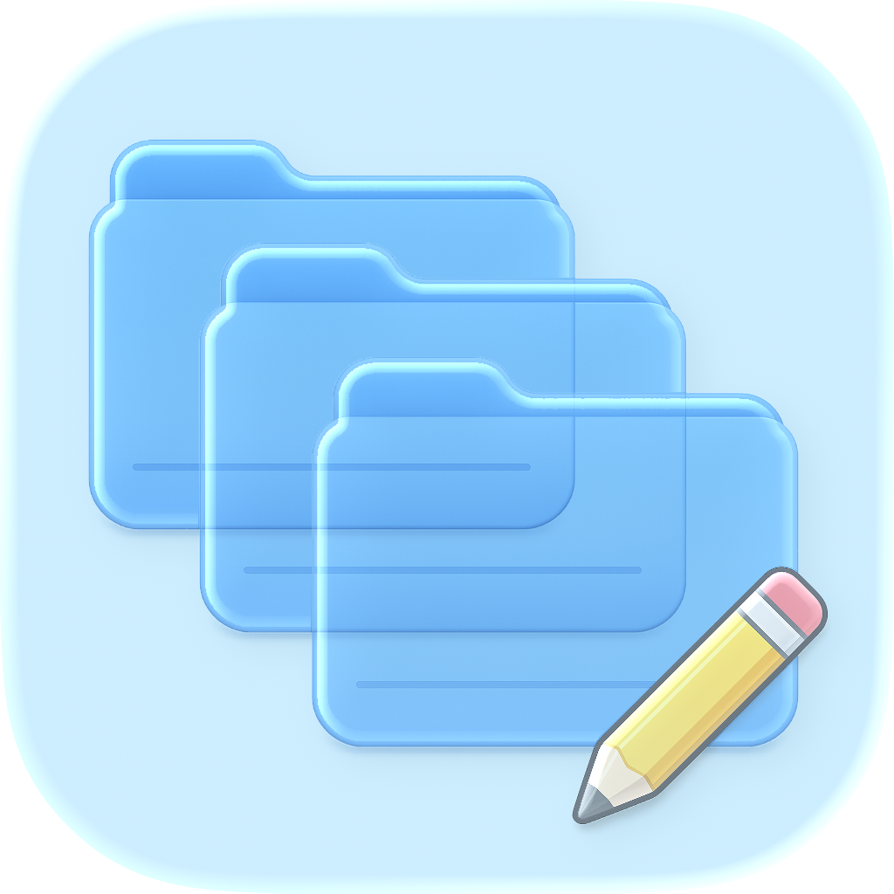
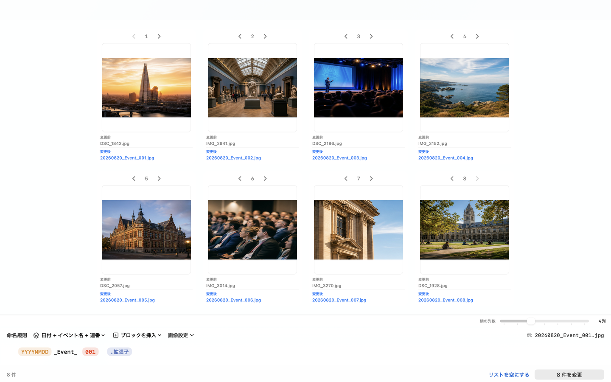

<p align="center">
  
</p>

<h1 align="center">FileRenamer</h1>

<p align="center">
  並べた順に連番が決まる、Mac用の一括リネームアプリ
</p>

<p align="center">
  <a href="https://github.com/hirakke/FileRenamer/releases/latest"><strong>最新版をダウンロード</strong></a>
  ・
  <a href="https://apps.apple.com/us/app/filerenamer/id6800803707?mt=12"><strong>App Store for Macからダウンロード</strong></a>
  ・
  <a href="https://hirakke.github.io/FileRenamer/privacy.html">プライバシーポリシー</a>
  ・
  <a href="https://github.com/hirakke/FileRenamer/issues">サポート</a>
</p>

FileRenamerは、複数のファイルを見やすく並べ、日付・固定文字・連番などを組み合わせて名前をまとめて変更するmacOSアプリです。

たとえば、ばらばらな写真名を次のように統一できます。

```text
DSC_1842.jpg  →  20260820_Event_001.jpg
IMG_2941.jpg  →  20260820_Event_002.jpg
IMG_3014.jpg  →  20260820_Event_003.jpg
```

変更後の名前は実行前に一覧で確認できます。名前の重複や保存先との衝突がある場合は、そのまま実行せず理由を表示します。

## 表示言語

表示言語は、macOSメニューバーの **FileRenamer → 設定…** から「システム設定に従う」「日本語」「English」を選べます。「システム設定に従う」では、macOSの優先言語が日本語の場合だけ日本語で表示し、それ以外は英語で表示します。ファイル名、命名規則の固定文字、作成したプリセット名は翻訳されません。

## アイコンビュー

写真を大きく見ながら、変更前と変更後のファイル名を確認できます。横に並べる数は2〜8列から選べます。



## FileRenamerでできること

- ファイルやフォルダをドラッグ＆ドロップしてまとめて読み込む
- 元ファイル名、作成日時、更新日時、撮影日時、ファイルサイズで並べ替える
- ドラッグや矢印ボタンで順番を微調整し、その順番を連番へ反映する
- 日付、連番、元の名前、固定文字、写真情報をブロックとして組み合わせる
- リスト表示とアイコンビューを切り替え、横に並べる数を調整する
- JPEG・PNG・HEIC画像をJPEGまたはPNGへ変換する
- 縦横比を保ったまま、画像の長辺を指定サイズへ揃える
- ダブルクリックまたはスペースキーで画像、PDF、動画などをプレビューする
- 複数の命名作業をタブとして同時に開く
- 完全一致または見た目が似ている画像を候補として確認する

類似画像の確認はMac内だけで行われます。アプリが画像を自動削除したり、リストから勝手に除外したりすることはありません。ゴミ箱へ移動する場合も、確認画面で利用者が明示的に選んだファイルだけです。

## 動作環境

- macOS 14.0以降
- Apple Silicon Mac／Intel Mac

配布用DMGはAppleの公証済みです。

## インストール

1. [最新のリリース](https://github.com/hirakke/FileRenamer/releases/latest)から `FileRenamer-*.dmg` をダウンロードします。
2. DMGを開きます。
3. `FileRenamer` を `Applications` フォルダへドラッグします。
4. 「アプリケーション」フォルダからFileRenamerを開きます。

## はじめてのリネーム

### 1. ファイルを追加する

上部の「ファイルを追加」または「フォルダを追加」を押します。Finderからウィンドウへ直接ドロップすることもできます。

フォルダを読み込んだ場合は、作業中のフォルダ名が上部に表示されます。クリックするとFinderでその場所を開けます。

### 2. 順番を決める

ツールバーの並べ替えから基準を選ぶか、行をドラッグして好きな順番にします。

連番はリストの上から `001`、`002`、`003` のように割り当てられます。順番を動かすと、変更後の名前もすぐに更新されます。

### 3. 命名ルールを作る

最初は組み込みプリセットを選ぶだけでも使えます。独自のルールを作る場合は、固定文字をそのまま入力し、変化する部分だけを「ブロックを挿入」から追加します。

| ブロック | 用途 | 表示例 |
| --- | --- | --- |
| 日付 | 作成日・更新日・撮影日を入れる | `20260820` |
| 連番 | 並び順に番号を付ける | `001` |
| 元の名前 | 元ファイル名の一部または全部を使う | `DSC_1842` |
| 写真情報 | カメラ、レンズ、ISO感度などを使う | `ISO800` |
| 固定文字 | イベント名や区切りを入力する | `_Event_` |

たとえば「撮影日 + `_Event_` + 3桁の連番」というルールから、`20260820_Event_001.jpg` が作られます。拡張子は通常、元ファイルのものを自動で引き継ぎます。

### 4. 変更内容を確認する

一覧には「元のファイル名」と「変更後」が並んで表示されます。ファイルをダブルクリックするかスペースキーを押すと、独立したプレビューで内容を確認できます。

緑のチェックは実行可能、オレンジの警告は確認事項、赤いエラーは修正が必要な項目です。エラーの理由は行の右側から確認できます。

### 5. 変更を実行する

右下の「○件を変更」を押し、最終確認画面で内容を確認してから実行します。

外付けドライブなどへのアクセスが必要な場合だけ、macOSのフォルダ選択画面が表示されます。すでに操作できる場所について、毎回許可を求めることはありません。

## 画像変換とリサイズ

「画像設定」から、画像形式とリサイズを指定できます。

- 出力形式：変更しない／JPEG／PNG
- 長辺：64〜20,000 pxの範囲で指定
- 拡大防止：小さい画像を意図せず引き伸ばさない設定が初期状態で有効
- JPEG品質：100%／95%（推奨）／90%／80%／カスタム

画像変換とリサイズはJPEG、PNG、HEIC／HEIFの入力に対応します。出力できる形式はJPEGとPNGです。RAW画像は名前変更やメタデータ利用には対応しますが、画像内容の変換対象にはなりません。

画像データを書き換える処理では、実行前に「元画像を残す」か「元画像を置き換える」かを選べます。元画像を残す場合は、保存する新規フォルダの名前と作成場所も指定できます。

JPEGは保存時に再圧縮されます。JPEG品質100%、JPEGのまま、リサイズなしの場合は、初期設定では再圧縮せず名前変更だけを行います。

## 安心して使うための仕組み

- **実行前確認**：変更前後の名前、画像処理、原本の扱いを確認してから実行します
- **衝突防止**：同じ名前、既存ファイル、不正な文字、長すぎる名前を事前に検出します
- **安全な入れ替え**：ファイル名を一時名へ移してから確定するため、名前の交換も安全に行えます
- **失敗時の復元**：途中で失敗した場合は、完了済みの変更も可能な範囲で元へ戻します
- **クラッシュ復旧**：処理中にアプリが終了した場合は、次回起動時に未完了の処理を確認します
- **Undo／Redo**：前回のファイル操作を `⌥⌘Z` で元に戻し、`⇧⌥⌘Z` でやり直せます
- **ローカル処理**：ファイル、画像、ファイル名、利用状況を外部へ送信しません

通常の名前変更では、ファイルの内容を変更しません。画像変換やリサイズを有効にした場合だけ、画像データを新しく生成します。

## よく使う操作

| 操作 | ショートカット |
| --- | --- |
| 新しい命名作業を開く | `⌘T` |
| ファイルを追加 | `⌘O` |
| フォルダを追加 | `⇧⌘O` |
| クイックルック | `Space` |
| 選択項目を1つ前／後ろへ移動 | `⌘↑`／`⌘↓` |
| 選択項目を先頭／末尾へ移動 | `⌥⌘↑`／`⌥⌘↓` |
| リストから除外 | `Delete` |
| 前回のリネームを元に戻す | `⌥⌘Z` |

通常の文字入力を元に戻す操作には、macOS標準の `⌘Z` を使用します。

## よくある質問

### 写真以外のファイルも名前変更できますか？

はい。PDF、動画、音声、Office文書なども名前変更できます。プレビューできる形式は、macOSのクイックルックが対応している形式に準じます。

### フォルダ内のファイルが勝手に変更されることはありますか？

ありません。読み込んだだけでは変更されず、確認画面で「変更を実行」を押した項目だけが対象になります。

### 同じ名前になるファイルがある場合はどうなりますか？

実行前にエラーとして表示されます。既存ファイルを黙って上書きすることはありません。

### 類似画像の警告が出たら削除されますか？

自動では削除されません。比較候補を確認し、必要な場合だけ利用者が明示的に選んだファイルをFinderのゴミ箱へ移動できます。検出自体を「FileRenamer」メニューの「設定…」から無効にすることもできます。

### 設定画面はどこにありますか？

画面上部のmacOSメニューバーから「FileRenamer」→「設定…」を選びます。実行前確認、画像の拡大防止、類似画像検出、表示形式、グリッド列数などを変更できます。

### アップデートはどう確認しますか？

画面上部のmacOSメニューバーから「FileRenamer」→「アップデートを確認…」を選びます。自動確認は「FileRenamer」→「設定…」でオンにできます。

## プライバシーとサポート

- [プライバシーポリシー](https://hirakke.github.io/FileRenamer/privacy.html)
- [不具合報告・問い合わせ](https://github.com/hirakke/FileRenamer/issues)
- [過去のリリースと更新履歴](https://github.com/hirakke/FileRenamer/releases)

---

Copyright © 2026 Keiju Hiramoto. All rights reserved.
